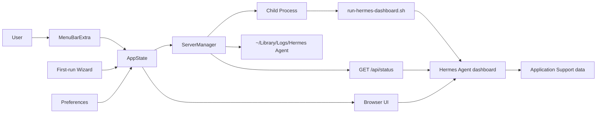

# Architecture

Hermes Agent for macOS is split into a native menu bar launcher and a local Hermes Agent dashboard runtime.



## Native Launcher

`HermesAgentApp` owns the menu bar scene. `AppState` is the observable state source for server status, port, errors, first-run state, and uptime. `ServerManager` starts the child process, streams logs, performs health checks, and terminates the child process on quit.

## Runtime

The bundled runtime lives in `HermesAgent/Resources/runtime` during development and in `HermesAgent.app/Contents/Resources/runtime` after packaging.

The runner starts:

```bash
hermes dashboard --host 127.0.0.1 --port <port> --no-open --skip-build --tui
```

If the bundled server source is read-only or the target Mac needs a fresh Python environment, the runner copies Hermes Agent source into:

```text
~/Library/Application Support/Hermes Agent/runtime/server-source
```

and creates:

```text
~/Library/Application Support/Hermes Agent/runtime/venv
```

This keeps architecture-specific Python artifacts out of the `.app` and lets Apple Silicon and Intel Macs bootstrap the correct dependencies.

## Data Paths

- Data: `~/Library/Application Support/Hermes Agent`
- Runtime bootstrap: `~/Library/Application Support/Hermes Agent/runtime`
- Cache: `~/Library/Caches/Hermes Agent`
- Logs: `~/Library/Logs/Hermes Agent`
- Preferences: `~/Library/Preferences/com.hermes.app.plist`
- Auth token: `~/Library/Application Support/Hermes Agent/auth_token`
